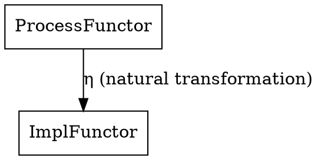

<EXTREMELY-IMPORTANT>
If you think there is even a 1% chance a skill might apply to what you are doing, you ABSOLUTELY MUST invoke the skill.

IF A SKILL APPLIES TO YOUR TASK, YOU DO NOT HAVE A CHOICE. YOU MUST USE IT.

This is not negotiable. This is not optional. You cannot rationalize your way out of this.
</EXTREMELY-IMPORTANT>

## How to Access Skills

**In Claude Code:** Use the `Skill` tool. When you invoke a skill, its content is loaded and presented to you—follow it directly. Never use the Read tool on skill files.

**In other environments:** Check your platform's documentation for how skills are loaded.

# Using Skills

## The Rule

**Invoke relevant or requested skills BEFORE any response or action.** Even a 1% chance a skill might apply means that you should invoke the skill to check. If an invoked skill turns out to be wrong for the situation, you don't need to use it.

## Red Flags

These thoughts mean STOP—you're rationalizing:

| Thought | Reality |
|---------|---------|
| "This is just a simple question" | Questions are tasks. Check for skills. |
| "I need more context first" | Skill check comes BEFORE clarifying questions. |
| "Let me explore the codebase first" | Skills tell you HOW to explore. Check first. |
| "I can check git/files quickly" | Files lack conversation context. Check for skills. |
| "Let me gather information first" | Skills tell you HOW to gather information. |
| "This doesn't need a formal skill" | If a skill exists, use it. |
| "I remember this skill" | Skills evolve. Read current version. |
| "This doesn't count as a task" | Action = task. Check for skills. |
| "The skill is overkill" | Simple things become complex. Use it. |
| "I'll just do this one thing first" | Check BEFORE doing anything. |
| "This feels productive" | Undisciplined action wastes time. Skills prevent this. |
| "I know what that means" | Knowing the concept ≠ using the skill. Invoke it. |

## Skill Priority

When multiple skills could apply, use this order:

1. **Process skills first** (brainstorming, debugging) - these determine HOW to approach the task
2. **Implementation skills second** (frontend-design, mcp-builder) - these guide execution

"For abstract thinkers" - If you think in category theory, abstract algebra, or universal properties, also consider invoking **superpowers:categorical-reframing** to map concepts to categorical terms before selecting other skills.

"Let's build X" → brainstorming first, then implementation skills.
"Fix this bug" → debugging first, then domain-specific skills.

## Skill Types

**Rigid** (TDD, debugging): Follow exactly. Don't adapt away discipline.

**Flexible** (patterns): Adapt principles to context.

The skill itself tells you which.

## User Instructions

Instructions say WHAT, not HOW. "Add X" or "Fix Y" doesn't mean skip workflows.

---

## Categorical Framing

<EXTREMELY-IMPORTANT>
This section provides a category-theoretic interpretation of skill invocation. It is OPTIONAL but recommended for developers who think in abstractions.
</EXTREMELY-IMPORTANT>

### Skills as Morphisms

Think of each skill as a **morphism** in a category of development workflows:

- **Domain**: The task context (what the user asked)
- **Codomain**: The resolved context (task completed properly)
- **Composition**: Skills compose - brainstorming → planning → executing → reviewing

### The Skill Functor

The Skill tool is a **functor** that maps:
- The category of conversation states → The category of skill applications
- Preserves structure: if task A ≤ task B in complexity, then skill(A) ≤ skill(B) in application

### Universal Property: The 1% Rule

The rule "invoke skills on even 1% chance" can be understood as finding the **universal morphism**:

> There exists a unique skill invocation that covers all tasks with any probability of skill applicability.

The 1% threshold ensures we're in the **closure** of the skill category - we don't miss any relevant skills.

### Natural Transformations

When multiple skills apply, the priority order (process → implementation) forms a **natural transformation** between functors:

The naturality condition ensures that regardless of the task, the transformation from process skills to implementation skills is consistent.

### The Terminal State

The goal of any task is reaching the **terminal object** in the development category - the state where:
- All skills invoked appropriately
- Workflows followed
- Task resolved completely

### Invoking This Framing

When working on a task, you can invoke `superpowers:categorical-reframing` to map the specific development concepts to their categorical equivalents, then apply the appropriate skill morphisms in the correct order.

---

## Summary

| Concept | Categorical Interpretation |
|---------|---------------------------|
| Skill | Morphism in workflow category |
| Skill check | Functor application |
| Process → Implementation | Natural transformation |
| Correct workflow | Commuting diagram |
| Task completion | Terminal object |
