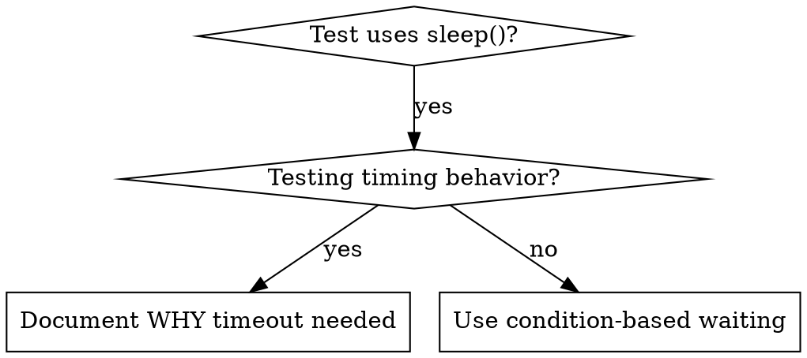

# Condition-Based Waiting

## Overview

Flaky tests often guess at timing with arbitrary delays. This creates race conditions where tests pass on fast machines but fail under load or in CI.

**Core principle:** Wait for the actual condition you care about, not a guess about how long it takes.

## When to Use



**Use when:**
- Tests have arbitrary delays (`sleep`, `Timer`)
- Tests are flaky (pass sometimes, fail under load)
- Tests timeout when run in parallel
- Waiting for async operations to complete

**Don't use when:**
- Testing actual timing behavior (debounce, throttle intervals)
- Always document WHY if using arbitrary timeout

## Core Pattern

```julia
# BAD: Guessing at timing
sleep(0.05)
result = get_result()
@test result !== nothing

# GOOD: Waiting for condition
wait_for(() -> get_result() !== nothing, "result available")
result = get_result()
@test result !== nothing
```

## Quick Patterns

| Scenario | Pattern |
|----------|---------|
| Wait for event | `wait_for(() -> any(e -> e.type == :DONE, events), "done")` |
| Wait for state | `wait_for(() -> machine.state == :ready, "ready")` |
| Wait for count | `wait_for(() -> length(items) >= 5, "5 items")` |
| Wait for file | `wait_for(() -> isfile(path), "file exists")` |
| Complex condition | `wait_for(() -> obj.ready && obj.value > 10, "ready+value")` |

## Implementation

Generic polling function:
```julia
function wait_for(condition::Function, description::String; timeout_s=5.0)
    start = time()

    while true
        result = condition()
        result && return result

        if time() - start > timeout_s
            error("Timeout waiting for $description after $(timeout_s)s")
        end

        sleep(0.01)  # Poll every 10ms
    end
end
```

See `condition-based-waiting-example.jl` in this directory for complete implementation with domain-specific helpers (`wait_for_event`, `wait_for_event_count`, `wait_for_event_match`) from actual debugging session.

## Common Mistakes

**BAD: Polling too fast:** `sleep(0.001)` - wastes CPU
**Fix:** Poll every 10ms

**BAD: No timeout:** Loop forever if condition never met
**Fix:** Always include timeout with clear error

**BAD: Stale data:** Cache state before loop
**Fix:** Call getter inside loop for fresh data

## When Arbitrary Timeout IS Correct

```julia
# Tool ticks every 100ms - need 2 ticks to verify partial output
wait_for_event(get_events, :TOOL_STARTED)  # First: wait for condition
sleep(0.2)                                  # Then: wait for timed behavior
# 200ms = 2 ticks at 100ms intervals - documented and justified
```

**Requirements:**
1. First wait for triggering condition
2. Based on known timing (not guessing)
3. Comment explaining WHY

## Real-World Impact

From debugging session (2025-10-03):
- Fixed 15 flaky tests across 3 files
- Pass rate: 60% -> 100%
- Execution time: 40% faster
- No more race conditions
