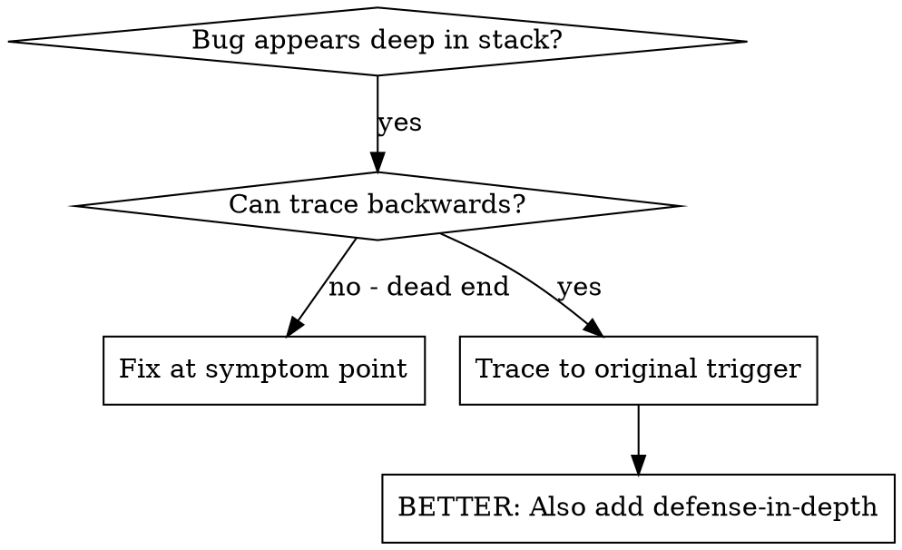
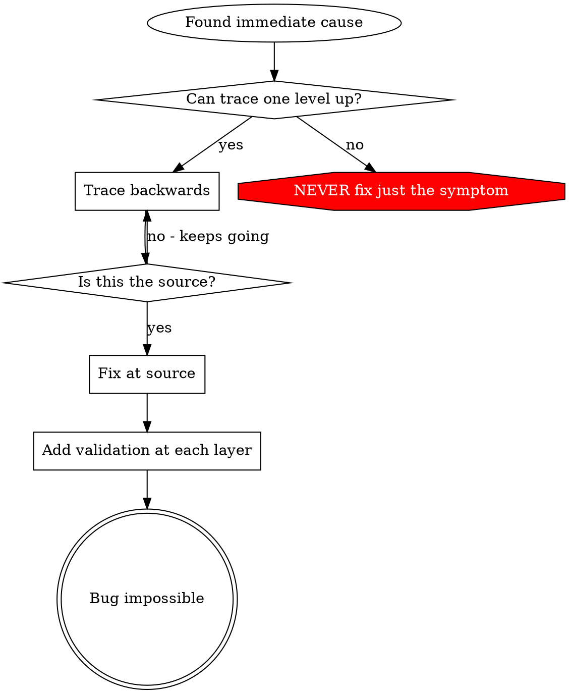

# Root Cause Tracing

## Overview

Bugs often manifest deep in the call stack (git init in wrong directory, file created in wrong location, database opened with wrong path). Your instinct is to fix where the error appears, but that's treating a symptom.

**Core principle:** Trace backward through the call chain until you find the original trigger, then fix at the source.

## When to Use



**Use when:**
- Error happens deep in execution (not at entry point)
- Stack trace shows long call chain
- Unclear where invalid data originated
- Need to find which test/code triggers the problem

## The Tracing Process

### 1. Observe the Symptom
```
Error: git init failed in /home/adjointantics/project/packages/core
```

### 2. Find Immediate Cause
**What code directly causes this?**
```julia
run(Cmd(`git init`, dir=project_dir))
```

### 3. Ask: What Called This?
```julia
create_session_worktree(project_dir, session_id)
  # called by initialize_workspace(session)
  # called by create_session(session)
  # called by test at create_project()
```

### 4. Keep Tracing Up
**What value was passed?**
- `project_dir = ""` (empty string!)
- Empty string as `dir` resolves to `pwd()`
- That's the source code directory!

### 5. Find Original Trigger
**Where did empty string come from?**
```julia
ctx = setup_core_test()  # Returns (; temp_dir = "")
create_project("name", ctx.temp_dir)  # Accessed before setup!
```

## Adding Stack Traces

When you can't trace manually, add instrumentation:

```julia
function git_init(directory::String)
    st = stacktrace()
    @error "DEBUG git init" directory pwd=pwd() julia_env=get(ENV, "JULIA_ENV", "") stack=st

    run(Cmd(`git init`, dir=directory))
end
```

**Critical:** Use `@error` in tests (not custom logger - may not show)

**Run and capture:**
```bash
yon test 2>&1 | grep 'DEBUG git init'
```

**Analyze stack traces:**
- Look for test file names
- Find the line number triggering the call
- Identify the pattern (same test? same parameter?)

## Finding Which Test Causes Pollution

If something appears during tests but you don't know which test:

Use the bisection script `find-polluter.sh` in this directory:

```bash
./find-polluter.sh '.git' 'test/test_*.jl'
```

Runs tests one-by-one, stops at first polluter. See script for usage.

## Real Example: Empty projectDir

**Symptom:** `.git` created in `packages/core/` (source code)

**Trace chain:**
1. `git init` runs in `pwd()` <- empty dir parameter
2. create_session_worktree called with empty project_dir
3. create_session() passed empty string
4. Test accessed `ctx.temp_dir` before setup
5. setup_core_test() returns `(; temp_dir = "")` initially

**Root cause:** Top-level variable initialization accessing empty value

**Fix:** Made temp_dir a getter that throws if accessed before setup

**Also added defense-in-depth:**
- Layer 1: create_project() validates directory
- Layer 2: WorkspaceManager validates not empty
- Layer 3: JULIA_ENV guard refuses git init outside tmpdir
- Layer 4: Stack trace logging before git init

## Key Principle



**NEVER fix just where the error appears.** Trace back to find the original trigger.

## Stack Trace Tips

**In tests:** Use `@error` not custom logger - logger may be suppressed
**Before operation:** Log before the dangerous operation, not after it fails
**Include context:** Directory, pwd, environment variables, timestamps
**Capture stack:** `stacktrace()` shows complete call chain

## Real-World Impact

From debugging session (2025-10-03):
- Found root cause through 5-level trace
- Fixed at source (getter validation)
- Added 4 layers of defense
- 1847 tests passed, zero pollution
